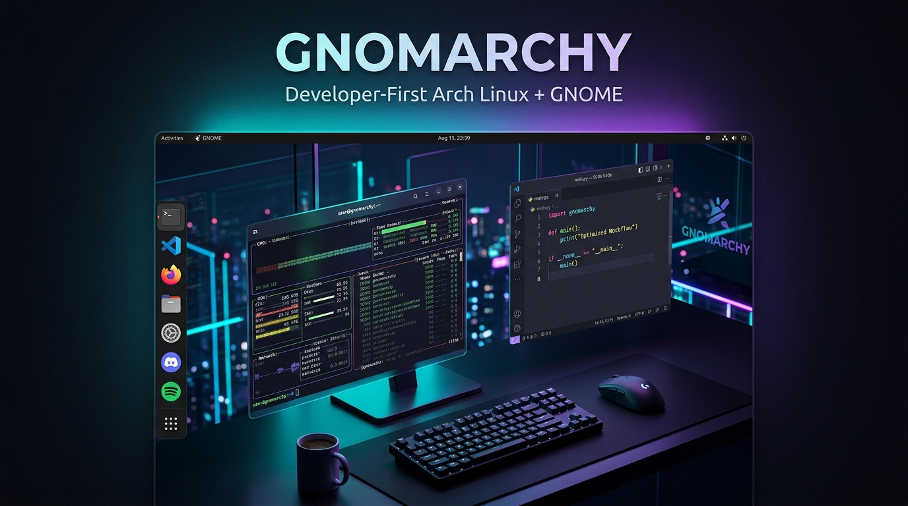

# Gnomarchy Linux 🐧

<p align="center">
  
</p>

<p align="center">
  <a href="https://gnomarchy.pages.dev"></a>
  <a href="https://github.com/hteariH/Gnomarchy/releases"></a>
  
  
  
  
  <a href="LICENSE"></a>
</p>

> **The Power of Arch Linux and Omarchy's Developer Tooling Meets the Polish of GNOME.**

Gnomarchy is an opinionated, developer-first Linux distribution built on **Arch Linux**. It takes the modern rolling base, Btrfs + Snapper atomic rollback snapshots, hardware quirk mitigations, unified theme engine, and agentic CLI developer stack from **Omarchy**—and replaces the Hyprland tiling compositor stack with a finely tuned, keyboard-friendly **GNOME 50** desktop environment and **GDM**.

---

## Highlights & Features

- **⌨️ Command Center (`Super + Alt + Space`)**: One keystroke to themes, web apps, screen capture, snapshots, updates and power actions—the whole system layer behind a single searchable menu.
- **🎨 Unified Cross-Desktop Theme Engine**: Change your entire system theme—GNOME dark/light mode, Libadwaita accent color, GTK3/GTK4 window colors, wallpaper, GNOME Terminal, Alacritty, Neovim (LazyVim), and btop—with a single command (`gnomarchy theme set <name>`).
- **🧩 Two Tiling Models**: Manual grid tiling with Tactile (`Super + T`) by default, or Hyprland-style **dynamic auto-tiling** where new windows place themselves and neighbours resize to fit — one command apart (`gnomarchy tiling enable`).
- **🎙️ Voxtype (System-Wide AI Dictation)**: Speech-to-text dictation on `<Super>D` powered by local, offline Whisper AI models with zero cloud fees and zero telemetry.
- **🌐 Web App Generator (`gnomarchy webapp`)**: Turn web tools (Claude, ChatGPT, Linear, Notion, Basecamp) into standalone desktop apps with isolated profiles, auto-fetched favicons, and Dash to Dock pinning.
- **📁 Nautilus Context Superpowers**: Native right-click file actions for fast video compression for Discord/Slack (25MB), GIF creation, MP3 extraction, WebP conversion, EXIF stripping, and LocalSend sharing.
- **🪟 Windows 11 VM Automation (`gnomarchy windows`)**: One-command creation and execution of hardware-accelerated Windows 11 KVM VMs with VirtIO and software TPM 2.0 (`swtpm`).
- **⏰ Desktop Reminders & Alarms (`gnomarchy reminder`)**: Instant notification alarms with chime audio cues for pomodoro breaks, standups, or deploy checks.
- **🤖 AI Agent OS Control Layer & Lifecycle Hooks**: Pre-installed agent skill (`AGENTS.md`) and hooks directory (`~/.config/gnomarchy/hooks/`) allowing Claude Code, Antigravity, OpenCode, or user scripts to orchestrate and react to system events.
- **🛡️ Bulletproof Btrfs & Snapper Rollbacks**: Automated boot snapshots integrated with the Limine bootloader let you roll back kernel or package updates directly from the boot menu.
- **⚡ Fast Shutdown Tuning**: Systemd timeout stop limits tuned from 90s down to 10s for instantaneous power-offs and reboots.
- **👾 Retro Terminal Screensaver (`gnomarchy screensaver`)**: Fullscreen matrix rain screensaver triggered via `<Super>Escape`.
- **🛡️ Default Privacy Browser (Brave Origin)**: **Brave Origin** pre-configured as the default system browser—completely debloated of crypto, AI (Leo), rewards, and telemetry, delivering uncompromising speed and ad-blocking out of the box.
- **🖥️ Ubuntu-Style Left Dock (Dash to Dock)**: Full-height, clean left panel with pinned favorites (GNOME Terminal, Brave Origin, Files, VS Code, Bazaar App Store).
- **📝 VS Code as the Default Editor**: Preinstalled from the official Arch repository and wired up as the graphical default for source and text files. `$EDITOR` resolves to `code --wait` under a graphical session and `nano` in a TTY or over SSH. Neovim stays installed and themed for those who prefer it.
- **🎮 One-Command Gaming Stack**: `gnomarchy gaming install` sets up Steam, Proton-GE, Wine, Lutris, Faugus Launcher, gamescope, GameMode and MangoHud, with the 32-bit Vulkan driver matched to your GPU.
- **💬 Telegram & Discord Preinstalled**
- **🛍️ Flatpak & Bazaar App Store**: Out-of-the-box Flatpak and Flathub integration with **Bazaar**, the modern, native GNOME software store for Flatpaks.
- **💻 Hardware Profiles**: Detected and applied at install time — **Asus ROG and TUF** laptops (asusctl and ROG Control Center: fan curves, platform profiles, keyboard backlight, battery charge limit, plus supergfxctl for GPU switching on hybrid models), **Framework 13/16** (keyboard RGB access and the AMD microphone profile), **Apple T2** Macs, **Nvidia** (DRM modesetting and suspend/resume services), and **Intel** graphics (media drivers and Vulkan).

---

## Desktop Workflow & Keyboard Shortcuts

| Shortcut | Action |
| :--- | :--- |
| <kbd>Super</kbd> + <kbd>Alt</kbd> + <kbd>Space</kbd> | **Command Center**: Themes, web apps, capture, snapshots, updates, power |
| <kbd>Super</kbd> + <kbd>T</kbd> | **Tactile Grid Tiling**: Launch interactive grid overlay to snap windows (manual mode) |
| <kbd>Super</kbd> + <kbd>H</kbd>/<kbd>J</kbd>/<kbd>K</kbd>/<kbd>L</kbd> | Focus window left/down/up/right (dynamic mode) |
| <kbd>Super</kbd> + <kbd>Shift</kbd> + <kbd>H</kbd>/<kbd>J</kbd>/<kbd>K</kbd>/<kbd>L</kbd> | Move window in that direction (dynamic mode) |
| <kbd>Super</kbd> + <kbd>Return</kbd> | Launch **GNOME Terminal** (themed Gnomarchy profile) |
| <kbd>Super</kbd> + <kbd>B</kbd> | Launch default web browser (**Brave Origin**) |
| <kbd>Super</kbd> + <kbd>E</kbd> | Open **Nautilus** file manager |
| <kbd>Super</kbd> | Open **GNOME Overview** & Instant App Search |
| <kbd>Super</kbd> + <kbd>W</kbd> | Close focused window |
| <kbd>Super</kbd> + <kbd>Up</kbd> | Maximize focused window |
| <kbd>Super</kbd> + <kbd>Backspace</kbd> | Interactive window resize mode |
| <kbd>Super</kbd> + <kbd>1</kbd> – <kbd>6</kbd> | Switch directly to workspace 1 through 6 |
| <kbd>Super</kbd> + <kbd>Shift</kbd> + <kbd>1</kbd> – <kbd>6</kbd> | Move focused window to workspace 1 through 6 |
| <kbd>Super</kbd> + <kbd>D</kbd> | **Voxtype**: Toggle AI Speech-to-Text Dictation |
| <kbd>Super</kbd> + <kbd>Escape</kbd> | **Screensaver**: Fullscreen Retro Matrix terminal screensaver |
| <kbd>Print</kbd> | Native GNOME interactive screenshot & recording grabber |
| <kbd>Ctrl</kbd> + <kbd>Print</kbd> | Region capture (grim + slurp) straight into the **Satty** annotation editor |

---

## Installation

### Method 1: Bootable Installation ISO (Recommended)

1. Download the latest `gnomarchy-linux-*.iso` from [Releases](https://github.com/hteariH/Gnomarchy/releases).
2. Flash to a USB drive using `dd`, `balenaEtcher`, or `caligula`:
   ```bash
   sudo dd if=gnomarchy-linux.iso of=/dev/sdX bs=4M status=progress oflag=sync
   ```
3. Boot your system in **UEFI mode** with Secure Boot temporarily disabled.
4. The automated installer will launch on TTY1, partition your drive with Btrfs subvolumes (`@`, `@home`, `@snapshots`, `@var_log`, `@var_cache`), optionally set up LUKS2 disk encryption, install packages, configure Limine + Snapper, and deploy the desktop.

### Method 2: Quick Install Over Clean Arch Linux

If you have already installed a minimal base Arch Linux system:

```bash
curl -fsSL https://raw.githubusercontent.com/hteariH/Gnomarchy/main/boot.sh | bash
```

---

## Master CLI Dispatcher (`gnomarchy`)

Control the desktop and OS layer using the `gnomarchy` CLI:

### Unified Theme Engine (22 Built-in Themes)

Gnomarchy includes **22 built-in themes** (18 Dark, 4 Light) matching the complete Omarchy palette suite. Every theme carries a Libadwaita accent color, generated GTK3/GTK4 window colors, a 16-color ANSI palette applied to both GNOME Terminal and Alacritty, a Neovim colorscheme, and a btop system monitor theme.

Wallpapers are **downloaded at install time** from the upstream Omarchy repository (pinned commit, every file checksum-verified) into `/usr/share/backgrounds/gnomarchy/<theme>/`. Gnomarchy does not redistribute them — see [BACKGROUNDS.md](BACKGROUNDS.md) for the provenance and licensing reasoning. Each theme also ships a small generated SVG wallpaper as an offline fallback, and you can override either with your own images in `~/.config/gnomarchy/backgrounds/<theme>/`.

| Theme | Type | Accent | Aesthetic / Palette Style |
| :--- | :--- | :--- | :--- |
| **Tokyo Night** | Dark | `blue` | Deep indigo Tokyo city lights |
| **Catppuccin** | Dark | `purple` | Soothing pastel Mocha dark |
| **Catppuccin Latte** | Light | `blue` | Warm soft pastel daylight paper |
| **Ethereal** | Dark | `purple` | Mystical cosmic violet & nebula glow |
| **Everforest** | Dark | `green` | Natural soothing moss & pine green |
| **Flexoki Light** | Light | `orange` | Kepano's warm inky paper for deep reading |
| **Gruvbox** | Dark | `orange` | Classic warm retro groove & amber |
| **Hackerman** | Dark | `green` | Phosphor cyber green Matrix CRT void |
| **Kanagawa** | Dark | `teal` | Hokusai Great Wave wave-blue & sumi ink |
| **Last Horizon** | Dark | `orange` | Dusky twilight violet & sunset orange |
| **Lumon** | Dark | `teal` | Severance Kier Eagan corporate CRT teal |
| **Lupine** | Light | `purple` | Wildflower lavender & gentle daylight |
| **Matte Black** | Dark | `slate` | Industrial stealth dark & minimal zinc |
| **Miasma** | Dark | `green` | Deep decaying forest lichen & moss |
| **Nord** | Dark | `teal` | Arctic ice blue & Nordic slate |
| **Osaka Jade** | Dark | `green` | Imperial Japanese bamboo & deep jade |
| **Retro 82** | Dark | `pink` | 1982 arcade synthwave magenta & neon cyan |
| **Ristretto** | Dark | `orange` | Roasted espresso crema & cinnamon dark |
| **Rosé Pine** | Dark | `pink` | Warm rose petal, pine, and gold |
| **Solitude** | Dark | `slate` | Calm introspective midnight slate blue |
| **Vantablack** | Dark | `slate` | Ultra-minimal pure OLED true black |
| **White** | Light | `blue` | Pristine minimalist high-key paper light |

```bash
# List all 22 available themes with mode and accent details
gnomarchy theme list

# Switch to any theme instantly
gnomarchy theme set "kanagawa"
gnomarchy theme set "hackerman"
gnomarchy theme set "flexoki-light"

# Check active theme
gnomarchy theme current

# Wallpapers: fetch, inspect or re-verify
gnomarchy backgrounds
gnomarchy backgrounds --list
gnomarchy backgrounds --verify
```

### Asus Laptops (ROG and TUF)

Detected automatically at install time; both lines share the same `asus_wmi`
interface, so one profile covers them.

```bash
gnomarchy asus status            # model, asusd, graphics mode, charge limit
gnomarchy asus gui               # ROG Control Center
gnomarchy asus charge 80         # stop charging at 80% to spare the battery
gnomarchy asus profile           # quiet / balanced / performance
gnomarchy asus keyboard med      # backlight
gnomarchy asus graphics          # switch integrated / hybrid GPU
```

`asusctl` and **ROG Control Center**, its official GUI, both come from the
official `extra` repository and coexist with power-profiles-daemon. `supergfxctl` is AUR-only and is installed only on
machines with a discrete NVIDIA GPU to switch to.

### Gaming

```bash
gnomarchy gaming install   # Steam, Proton-GE, Wine, Lutris, launchers, overlays
gnomarchy gaming status
gnomarchy gaming proton    # manage Proton versions
```

One command for a working gaming setup: Steam with its 32-bit dependencies,
Proton-GE and ProtonUp-Qt to keep it current, Wine, Lutris, Faugus Launcher,
gamescope, GameMode and MangoHud. multilib is enabled if it is not already, and
the 32-bit Vulkan driver is matched to the GPU rather than installing all of
them. See `gnomarchy manual gaming`.

### Window Tiling

Gnomarchy ships both tiling models and lets you pick:

```bash
# Hyprland-style dynamic auto-tiling: windows place themselves,
# neighbours resize to fit, navigation on hjkl
gnomarchy tiling enable

# Back to manual grid tiling with Tactile (the default)
gnomarchy tiling disable

# Which mode is active?
gnomarchy tiling status
```

### The Manual

```bash
gnomarchy manual                    # browse and search
gnomarchy manual 04                 # open a page by number
gnomarchy manual tiling             # or by name
gnomarchy manual --grep whisper     # search every page
```

Sixteen pages covering keybindings, tiling, themes, backgrounds, the menu,
terminal, Neovim, web apps, dictation, screenshots, updates and migrations,
snapshots, the Windows VM, and troubleshooting. Also on `Super + Shift + K`
and under **Manual** in the command center.

Unlike Omarchy's, which is a website, this manual is local: it works in a TTY,
with no network, and on the half-installed system where the troubleshooting
page is most needed.

### Keybindings Search

```bash
gnomarchy keybindings          # searchable list (also Super+K, or from the menu)
gnomarchy keybindings --list   # plain text, for grepping
```

The list is **derived from dconf**, not hand-maintained, so it always shows the
bindings that are actually in effect - including whichever keymap profile and
tiling mode are active. Descriptions come from each GSettings schema's own
summary. Unbound actions are omitted rather than listed as available.

### Omarchy Keyboard Layout

The Hyprland bindings from upstream Omarchy, transcribed to GNOME:

```bash
gnomarchy keymap omarchy   # Omarchy's layout: Super+arrows, 10 workspaces
gnomarchy keymap gnome     # Gnomarchy defaults (the default)
gnomarchy keymap status    # show the active layout and its bindings
```

The Omarchy layout moves focus to `Super`+arrows and window movement to
`Super+Shift`+arrows, expands to ten workspaces on `Super+1..0`, closes windows
with `Super+W` or `Super+Q`, and moves the browser and file manager to
`Super+Shift+B` and `Super+Shift+F`. Directional focus requires dynamic tiling,
so pair it with `gnomarchy tiling enable`.

One deliberate departure from upstream: Omarchy puts its menu on `Super+Space`,
which in GNOME switches the keyboard layout. Layout switching is used far more
often than a launcher, so it keeps `Super+Space` and the menu stays on
`Super+Alt+Space` in both profiles.

Bindings were transcribed from Omarchy's `default/hypr/bindings/*.lua`, not
from memory. What Hyprland does and GNOME cannot - window groups, the
scratchpad, pseudo-tiling, pixel-step resize - is listed by
`gnomarchy keymap status` rather than silently dropped.

**Dynamic** uses Tiling Shell with auto-tiling on: a new window is placed into
the layout automatically rather than opening floating. **Manual** uses Tactile:
`Super+T` opens a grid overlay and you choose the zone; nothing moves on its
own. Only one is active at a time - enabled together they fight over placement.

Switching takes effect after the shell reloads. Under Wayland that means
logging out and back in.

### Web Applications
```bash
# Convert web apps into isolated desktop applications
gnomarchy webapp add "Claude" "https://claude.ai"
gnomarchy webapp add "Linear" "https://linear.app"

# List and remove web apps
gnomarchy webapp list
gnomarchy webapp remove "Claude"
```

### Desktop Reminders
```bash
# Set relative countdowns or exact time reminders with sound cues
gnomarchy reminder 25m "Pomodoro break"
gnomarchy reminder 1h30m "Review PR"
gnomarchy reminder 17:30 "Team Standup"

# List and cancel active reminders
gnomarchy reminder list
gnomarchy reminder cancel <id>
```

### Voxtype AI Speech-to-Text
```bash
# Toggle audio capture and transcription (or press Super+D)
gnomarchy voxtype toggle
gnomarchy voxtype status
```

### Windows 11 VM Automation
```bash
# Setup and launch hardware-accelerated Windows 11 KVM VM
gnomarchy windows setup
gnomarchy windows start
gnomarchy windows status
```

### GNOME Management
```bash
# List active GNOME extensions
gnomarchy gnome extensions list

# Reset extensions to default Gnomarchy configuration
gnomarchy gnome extensions reset

# Show keyboard shortcuts guide or reset to defaults
gnomarchy gnome hotkeys
gnomarchy gnome hotkeys reset

# Enable experimental fractional scaling support
gnomarchy gnome scaling enable
```

### Rollback Snapshots
```bash
# Create an atomic snapshot before doing risky work
gnomarchy snapshot create "Before system refactor"

# List snapshots
gnomarchy snapshot list
```

### Command Center
```bash
# Open the menu (or press Super+Alt+Space)
gnomarchy menu
```

### Screen Capture
```bash
gnomarchy capture annotate   # region -> Satty annotation editor (Ctrl+Print)
gnomarchy capture region     # region -> ~/Pictures/Screenshots + clipboard
gnomarchy capture screen     # full screen
```

### System Updates, Migrations & Lifecycle Hooks
```bash
# Synchronize Arch packages, AUR packages, Gnomarchy config, and run any
# pending migrations against this machine
gnomarchy update

# Inspect or apply migrations on their own
gnomarchy migrate --list
gnomarchy migrate

# Trigger or inspect lifecycle event hooks (~/.config/gnomarchy/hooks/)
gnomarchy hook on-theme-change "tokyo-night"
```

Gnomarchy config changes reach **already-installed** machines through
`migrations/` — timestamped, idempotent scripts applied exactly once per
machine and recorded in `~/.local/state/gnomarchy/migrations.log`. A `git pull`
alone changes files; `gnomarchy update` is what applies them.

---

## Building the ISO Locally

To build your own bootable Gnomarchy ISO:

```bash
# Install archiso on an Arch host
sudo pacman -S archiso git

# Run the ISO builder
sudo ./iso/builder/build-iso.sh
```

The resulting ISO will be generated in `./out/`. You can test it immediately in QEMU:

```bash
./run-vm.sh
```

---

## License

Gnomarchy is open-source software licensed under the **[MIT License](LICENSE)**.
